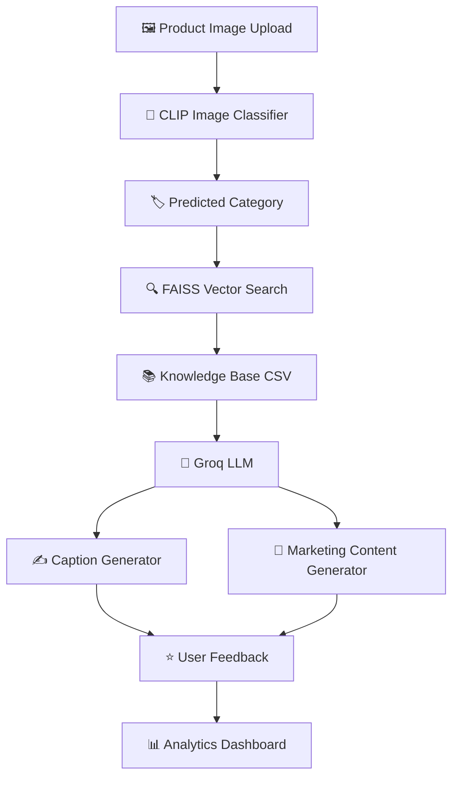
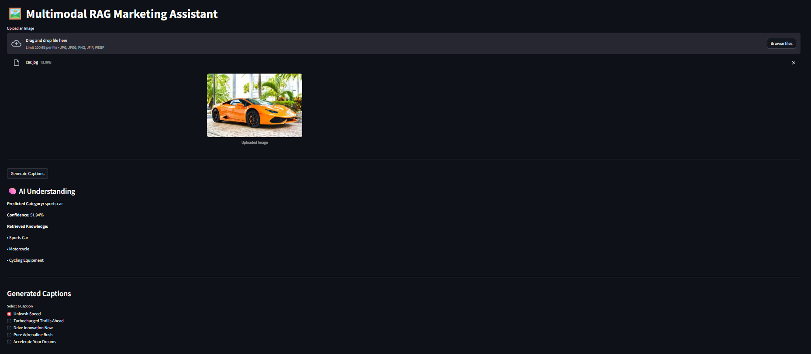
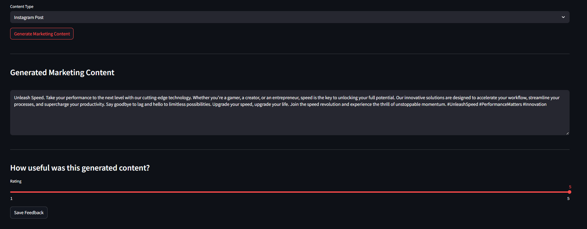
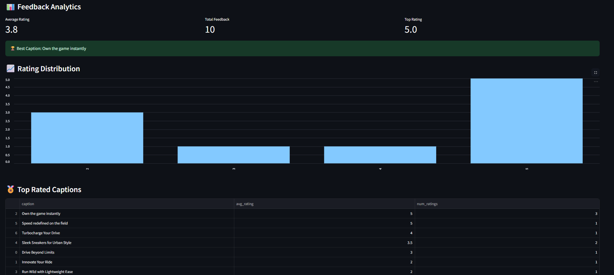

# 🚀 Multimodal RAG Marketing Assistant

AI-powered marketing content generation using CLIP, FAISS, Retrieval-Augmented Generation (RAG), Groq LLM, FastAPI, and Streamlit.


---

# 📌 Overview

The **Multimodal RAG Marketing Assistant** is an AI-powered application that generates marketing captions and promotional content directly from product images.

The system combines:

- 🖼️ Computer Vision (CLIP)
- 🔍 Retrieval-Augmented Generation (RAG)
- 📚 FAISS Vector Search
- 🤖 Groq LLM
- 📊 Feedback Analytics

The application analyzes uploaded images, predicts product categories, retrieves domain-specific marketing knowledge, generates engaging captions, creates marketing content, and collects user feedback for continuous evaluation.

---
# 🎯 Key Highlights

- Multimodal AI Pipeline (Vision + RAG + LLM)
- CLIP-Based Image Classification
- FAISS Semantic Retrieval
- Groq-Powered Content Generation
- Marketing Caption Generation
- Marketing Content Generation
- User Feedback Collection
- Analytics Dashboard
- FastAPI + Streamlit Architecture

---

# 🏗️ Architecture Diagram



## Workflow Explanation

### 1. Image Upload
Users upload a product image through the Streamlit interface.

### 2. CLIP Classification
The CLIP model analyzes the image and predicts the most relevant product category.

### 3. Retrieval-Augmented Generation (RAG)
The predicted category is used to retrieve relevant marketing knowledge from a FAISS vector database built from the knowledge base.

### 4. Knowledge Retrieval
Relevant marketing insights are fetched from the knowledge base and supplied as context.

### 5. Groq LLM Processing
The retrieved context and predicted category are sent to the Groq LLM.

### 6. Caption Generation
The model generates multiple marketing captions tailored to the detected product category.

### 7. Marketing Content Generation
Selected captions are expanded into:
- Instagram Posts
- Facebook Ads
- Product Descriptions
- LinkedIn Posts
- Email Marketing Copy

### 8. Feedback Collection
Users rate generated content and feedback is stored in CSV format.

### 9. Analytics Dashboard
Feedback is analyzed and visualized through an interactive dashboard showing ratings, top-performing captions, and overall system performance.

---
# ✨ Features

## 🖼️ Image Upload

Supports:

- JPG
- JPEG
- PNG
- WEBP
- JFIF

### Automatic Image Processing

- JFIF files automatically converted to JPG
- Product images stored for processing
- User-friendly upload interface

---

## 🤖 CLIP-Based Image Classification

Uses:

- CLIPModel
- CLIPProcessor

Recognizes categories such as:

### Fashion
- Running Shoes
- Sneakers
- Athletic Apparel

### Electronics
- Smart Watch
- Wireless Earbuds

### Beauty
- Skin Care Product

### Home
- Furniture
- Home Decor

### Travel
- Luggage

### Food
- Coffee Product

### Automotive
- Electric Vehicle
- Luxury Car
- Sports Car
- Motorcycle

### Sports
- Football
- Basketball
- Tennis Shoes
- Cricket Bat
- Cycling Equipment

---

## 🔍 Retrieval-Augmented Generation (RAG)

Uses:

- HuggingFace Embeddings
- FAISS Vector Search

Workflow:

Image → Category Prediction → FAISS Search → Knowledge Retrieval

Benefits:

- Context-aware content generation
- Improved caption quality
- Reduced hallucinations
- Domain-specific marketing knowledge

---

## ✍️ AI Caption Generation

Generates multiple marketing captions using:

- Retrieved knowledge
- Product category
- Groq LLM

Example Output:

```text
Own the game instantly.

Performance meets style.

Built for champions.
```

---

## 📢 Marketing Content Generation

Creates:

- Product descriptions
- Promotional copy
- Marketing campaigns
- Social media content
- Brand messaging

---

## 🧠 AI Understanding Panel

Provides transparency into the AI pipeline.

Displays:

- Predicted Category
- Confidence Score
- Retrieved Knowledge

Example:

```text
Category: Sports Car

Confidence: 51.94%

Retrieved Knowledge:
• Sports Car
• Motorcycle
• Cycling Equipment
```

---

## ⭐ Feedback System

Users can:

- Select preferred caption
- Rate generated captions
- Store feedback for analysis

Feedback stored in:

```text
data/feedback/feedback.csv
```

Fields:

```csv
timestamp,image_name,caption,rating
```

---

## 📊 Analytics Dashboard

Visualizes:

- Average Rating
- Total Feedback
- Top Rated Captions
- Best Performing Caption
- Rating Distribution
- Feedback History

Example Metrics:

```text
Average Rating: 3.8

Total Feedback: 10

Top Rating: 5.0

Best Caption:
Own the game instantly
```

# 🛠️ Tech Stack

| Component | Technology |
|------------|------------|
| Frontend | Streamlit |
| Backend | FastAPI |
| Vision Model | CLIP |
| Embeddings | HuggingFace |
| Vector Search | FAISS |
| LLM | Groq |
| Data Storage | CSV |
| Visualization | Plotly, Pandas |
| API Framework | FastAPI |
| Language | Python |

---

# 📂 Project Structure

```text
app/
│
├── backend/
│   └── main.py
│
├── frontend/
│   └── streamlit_app.py
│
├── llm/
│   ├── caption_generator.py
│   ├── marketing_content_generator.py
│   └── groq_client.py
│
├── rag/
│   ├── retriever.py
│   ├── multimodal_retriever.py
│   └── build_index.py
│
├── vision/
│   └── image_classifier.py
│
├── feedback/
│   ├── feedback_manager.py
│   └── feedback_analyzer.py
│
data/
│
├── uploads/
├── sample_images/
│
├── feedback/
│   └── feedback.csv
│
└── knowledge_base.csv

requirements.txt
.env
README.md
```

---

# 📥 Installation

## Clone Repository

```bash
git clone https://github.com/Dileepreddy2704/multimodal-rag-marketing-assistant.git

cd multimodal-rag-marketing-assistant
```

---

## Create Virtual Environment

### Windows

```bash
python -m venv venv

venv\Scripts\activate
```

### Linux / Mac

```bash
python3 -m venv venv

source venv/bin/activate
```

---

## Install Dependencies

```bash
pip install -r requirements.txt
```

---

# 🔐 Environment Variables

Create a `.env` file in the project root:

```env
GROQ_API_KEY=your_groq_api_key
```

---

# 🧱 Build FAISS Index

Before running the application:

```bash
python app/rag/build_index.py
```

---

# 🚀 Running the Backend

Start FastAPI:

```bash
uvicorn app.backend.main:app --reload
```

Backend URL:

```text
http://localhost:8000
```

Swagger Documentation:

```text
http://localhost:8000/docs
```

---

# 🎨 Running the Frontend

Start Streamlit:

```bash
streamlit run app/frontend/streamlit_app.py
```

Frontend URL:

```text
http://localhost:8501
```

---

# 🔄 Application Workflow

```text
Upload Image
      ↓
Image Classification (CLIP)
      ↓
Category Prediction
      ↓
Knowledge Retrieval (FAISS)
      ↓
Caption Generation
      ↓
Marketing Content Generation
      ↓
User Feedback
      ↓
Analytics Dashboard
```

---

# 📸 Screenshots

## Home Page



## AI Understanding Panel


## Marketing Content Generation



## Analytics Dashboard



# 📈 Sample Output

### Predicted Category

```text
Sports Car
```

### Generated Captions

```text
Own the game instantly.

Drive performance beyond limits.

Where speed meets excellence.
```

### Marketing Content

```text
Experience the thrill of precision engineering and unmatched performance.
Designed for enthusiasts who demand both style and power.
```

---
# 🏆 Project Outcomes

- Built an end-to-end Multimodal AI application
- Integrated CLIP for image understanding
- Implemented Retrieval-Augmented Generation using FAISS
- Generated marketing captions and promotional content using Groq LLM
- Developed a feedback collection and analytics system
- Created a scalable FastAPI + Streamlit architecture

# 🔮 Future Improvements

### Intelligent Prompt Engineering

Category-aware prompting for:

- Fashion
- Electronics
- Sports
- Beauty
- Home
- Travel
- Food
- Automotive

---

### Planned Enhancements

- Multi-language content generation
- User authentication
- Feedback-based learning
- Pinecone integration
- Weaviate integration
- Campaign templates
- A/B testing dashboard
- Advanced analytics
- Cloud deployment
- User management

---

# 🌐 Deployment Targets

Backend:

- Render
- Railway

Frontend:

- Streamlit Community Cloud

Containerization:

- Docker
- Docker Compose

---

# 👨‍💻 Author

**Dileep Reddy**

AI/ML Enthusiast | Generative AI | Computer Vision | Retrieval-Augmented Generation (RAG)

GitHub: https://github.com/Dileepreddy2704

---

# ⭐ Support

If you found this project useful:

⭐ Star the repository

🍴 Fork the project

🚀 Contribute to future improvements
